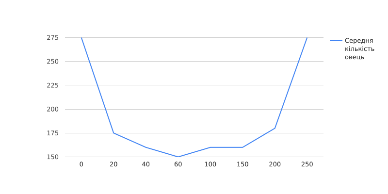
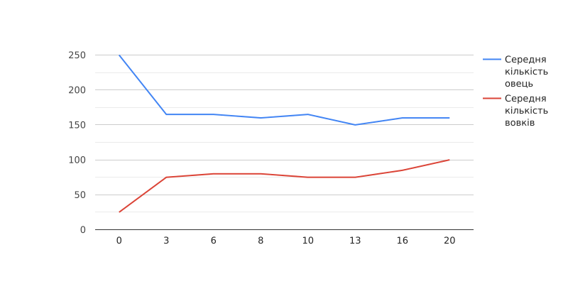
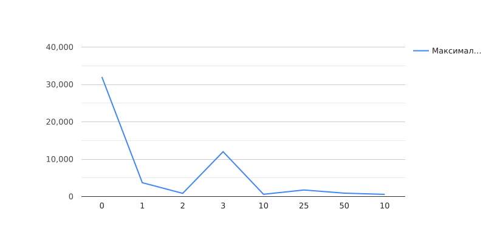

## Комп'ютерні системи імітаційного моделювання
## СПм-22-3, **Дюльгер Владислав Дмитрович**
### Лабораторна робота №**1**. Опис імітаційних моделей та проведення обчислювальних експериментів

 

### Варіант 7, модель у середовищі NetLogo:
[Wolf Sheep Predation](https://www.netlogoweb.org/launch#http://www.netlogoweb.org/assets/modelslib/Sample%20Models/Biology/Wolf%20Sheep%20Predation.nlogo)

 

### Вербальний опис моделі:
Ця модель досліджує стабільність екосистем хижак-жертва. Вовки та вівці випадково блукають по ландшафту, при цьому вовки шукають вівцей для полювання. Кожен крок вимагає від вовків енергії, і вони повинні поїдати вівців для поповнення своєї енергії - коли їм закінчується енергія, вони помирають. Щоб забезпечити продовження популяції, у кожного вовка або вівці є фіксована ймовірність розмноження на кожному кроці часу.

### Керуючі параметри:
- **model-version**. Визначає моделюємо ми овець, вовків і траву, чи просто овець і вовків.
- **initial-number-sheep**. Визначає початкову кількість вівцей у моделі.
- **initial-number-wolves**. Визначає початкову кількість вовків у моделі.
- **grass-regrowth-time**. Скільки часу потрібно, щоб трава відростала після того, як її з’їли (Зверніть увагу, що це не використовується у версії моделі вівці-вовки)
- **sheep-gain-from-food**. кількість енергії, яку вівці отримують за кожну з’їдену травинку.
- **wolf-gain-from-food**. Кількість енергії, яку отримують вовки за кожну з’їдену вівцю.
- **sheep-reproduce**. Визначає ймовірність, з якою вівці розмножуються під час кожного кроку симуляції.
- **wolf-reproduce**. Визначає ймовірність, з якою вовки розмножуються під час кожного кроку симуляції.
- **show-energy**. Визначає показувати чи ні енергію кожної тварини числом.

### Внутрішні параметри:
- **sheep**. Кількість вівець.
- **wolves**. Кількість вовків.
- **grass**. Кількість трави.

### Показники роботи системи:
- Кількість вівець.
- Кількість вовків.
- Кількість трави.

### Примітки:
При налаштуваннях керуючих параметрів за замовчуванням, зберігається відносний баланс та стабільність екосистеми.

### Недоліки моделі:
Значення параметрів можуть несподівано впливати на стабільність популяцій приводячи до повного вимирання одного з видів. 
 

## Обчислювальні експерименти
### 1. Вплив кількості вовків на кількість овець
Досліджується залежність кількості овець від початкової кількості вовків. 
Експерименти проводяться фіксована кількості овець та змінної кількості вовків.
Інші керуючі параметри мають значення за замовчуванням:

- **model-version**. sheep-wolves-grass
- **initial-number-sheep**. 100
- **grass-regrowth-time**. 30
- **sheep-gain-from-food**. 4
- **wolf-gain-from-food**. 20
- **sheep-reproduce**. 4%
- **wolf-reproduce**. 5%

<table>
<thead>
<tr><th>Початкова кількість вовків</th><th>Середня кількість овець</th></tr>
</thead>
<tbody>
<tr><td>0</td><td>275</td></tr>
<tr><td>20</td><td>175</td></tr>
<tr><td>40</td><td>160</td></tr>
<tr><td>60</td><td>150</td></tr>
<tr><td>100</td><td>160</td></tr>
<tr><td>150</td><td>160</td></tr>
<tr><td>200</td><td>180</td></tr>
<tr><td>250</td><td>275</td></tr>
</tbody>
</table>

Графік наочно показує, що крайні значення призводять до збільшення кількості овець.

### 2. Вплив шанса розмножування вовків на середню кількість овець
Досліджується залежність кількості овець від шанса розмножування вовків.
Беремо дефолтні параметри, за яких можлива стабільна екосистема. Експерименти проводяться при змінному шансу розмножування вовків.
Інші керуючі параметри мають значення за замовчуванням:
- **model-version**. sheep-wolves-grass
- **initial-number-sheep**. 100
- **initial-number-wolves**. 100
- **grass-regrowth-time**. 30
- **sheep-gain-from-food**. 4
- **wolf-gain-from-food**. 20
- **sheep-reproduce**. 4%
<table>
<thead>
<tr><th>Шанс розмножування вовків</th><th>Середня кількість овець</th><th>Середня кількість вовків</th></tr>
</thead>
<tbody>
<tr><td>0</td><td>250</td><td>25</td></tr>
<tr><td>3</td><td>165</td><td>75</td></tr>
<tr><td>6</td><td>165</td><td>80</td></tr>
<tr><td>8</td><td>160</td><td>80</td></tr>
<tr><td>10</td><td>165</td><td>75</td></tr>
<tr><td>13</td><td>150</td><td>75</td></tr>
<tr><td>16</td><td>160</td><td>85</td></tr>
<tr><td>20</td><td>160</td><td>100</td></tr>
</tbody>
</table>

Графік наочно показує, що збільшення шансу розмножування призодть до незначного зменшення кількості овець та збільшенню кількості вовків.

### 3. Зміная часу життя популяції від значень sheep-gain-from-food 
Досліджується максимальна кількість овець і залежності від параметру grass-regrowth-time.
Беремо дефолтні параметри, за яких можлива стабільна екосистема. Експерименти проводяться при змінній часу віднолення трави.
Інші керуючі параметри мають значення за замовчуванням:
- **model-version**. sheep-wolves-grass
- **initial-number-sheep**. 100
- **initial-number-wolves**. 100
- **wolf-gain-from-food**. 20
- **sheep-reproduce**. 4%
- **wolf-reproduce**. 5%
<table>
<thead>
<tr><th>Час відновлення трави</th><th>Максимальна кількість овець/th></tr>
</thead>
<tbody>
<tr><td>0</td><td>32К+</td></tr>
<tr><td>1</td><td>3700</td></tr>
<tr><td>2</td><td>850</td></tr>
<tr><td>3</td><td>12К</td></tr>
<tr><td>10</td><td>600</td></tr>
<tr><td>25</td><td>1750</td></tr>
<tr><td>50</td><td>900</td></tr>
<tr><td>100</td><td>580</td></tr>
</tbody>
</table>

Графік наочно показує, що збільшення часу відновення несподівано впливає на максимальну кількість овець.
 
### **Відповіді**
1. Моделювання - це процес побудови абстракцій або представлень реальних систем для аналізу, розуміння та прогнозу їхнього поведінки чи властивостей.
Моделювання включає в себе створення абстракцій або узагальнень реальних систем. Симуляція полягає в відтворенні поведінки системи в часі на основі створеної моделі.
2. Прогнозування поведінки системи. Аналіз взаємодії компонентів системи. Оптимізація рішень та проектування.
3. Об'єкт -одна окрема частина або елемент. Система - сукупність взаємопов'язаних елементів, які працюють разом для досягнення певних цілей.
4. Зміни в системі викликають зворотний вплив, що може зменшити або збільшити ці зміни.
5. Модель вважається адекватною, якщо вона достатньо точно відображає реальну систему в певних аспектах.
6. Фізичні (макети, макетування).
   Математичні (формальні рівняння).
   Імітаційні (комп'ютерні симуляції).
   Аналітичні (аналітичні вирази).
7. Описується за допомогою математичних або статистичних виразів, не включає комп'ютерну симуляцію.
8. Конкретний момент часу, в який можна оцінити параметри системи.
9. Використовують комп'ютер для відтворення динаміки системи в часі.
   Можуть включати в себе агентів та їх взаємодію.
10. Спрощений опис системи, що відображає лише основні аспекти.
11. Формулювання проблеми.
    Побудова моделі.
    Валідація моделі.
    Симуляція та аналіз.
    Інтерпретація результатів.
12. Індуктивний: Загальний висновок з будь-яких спостережень.
    Дедуктивний: Загальний висновок з теоретичних припущень.
13. Час, який протікає в межах моделі, не обов'язково відповідає реальному часу.

