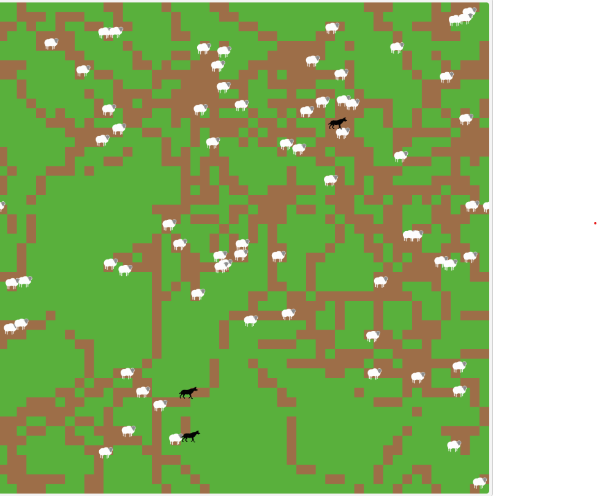
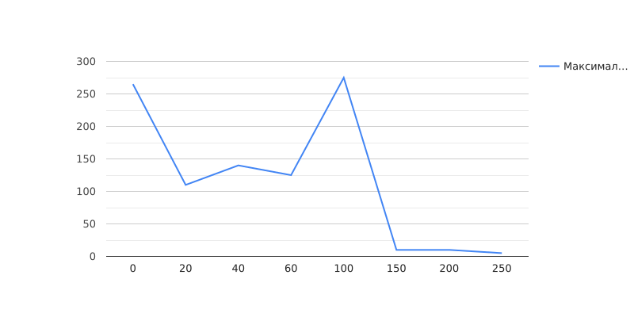

## Комп'ютерні системи імітаційного моделювання
## СПм-22-3, **Дюльгер Владисла Дмитрович**
### Лабораторна робота №**2**. Редагування імітаційних моделей у середовищі NetLogo

 

### Варіант 7, модель у середовищі NetLogo:
[Wolf Sheep Predation](https://www.netlogoweb.org/launch#http://www.netlogoweb.org/assets/modelslib/Sample%20Models/Biology/Wolf%20Sheep%20Predation.nlogo)

 

### Внесені зміни у вихідну логіку моделі, за варіантом:

**Перевірка на альфа самця** При знаходженні на одній ділянці поля двох вовків залишається лише один з них
додамо процедуру check-alfa-wolf яка буде перевіряти який з двох вовків залишиться 
<pre>
to check-alfa-wolf
  let other-wolf one-of wolves-here with [ self != myself ]
  if other-wolf != nobody [
    ifelse random 2 = 0 [
      ask other-wolf [ die ]
    ] [
      die
    ]
  ]
end
</pre>
Вставимо викилк процедури спочатку перед пересуванням 
<pre>
 ask wolves [
    check-alfa-wolf
    move
    set energy energy - 1
...
</pre>
**Перед початком свого ходу вовки повинні "оглядатися"**, перевіряючи оточення, та обирати напрямок руху виходячи з наявності вівець:
<pre>
let victim one-of sheep in-radius 3
ifelse victim != nobody [
  face victim
  fd 1
]
</pre>
Якщо немає іншої можливості – переміщається випадково
<pre>
 to move  ; turtle procedure
  ifelse breed = wolves [
    let victim one-of sheep in-radius 3
    ifelse victim != nobody [
      face victim
      fd 1
    ] [
      rt random 50
      lt random 50
      fd 1
    ]
  ] [
    ...
    ]
  ]
end
</pre>

**Вівці переміщаються випадковим чином, але при виявленні вовка на одній із клітин поруч змінюють напрямок на протилежний.** 
<pre>
to move  ; turtle procedure
  ifelse breed = wolves [
    ...
  ] [
    rt random 50
    lt random 50
    fd 1
    let nearby-wolf one-of wolves in-radius 1
    if nearby-wolf != nobody [
      face nearby-wolf
      lt 180
    ]
  ]
end
</pre>
Додамо в процедури reproduce-sheep та reproduce-wolves виклик процедури move 
<pre>
to reproduce-sheep  ; sheep procedure
  if random-float 100 < sheep-reproduce [  ; throw "dice" to see if you will reproduce
    set energy (energy / 2)                ; divide energy between parent and offspring
    hatch 1 [ move ]                       ; hatch an offspring and move it
  ]
end

to reproduce-wolves  ; wolf procedure
      if random-float 100 < wolf-reproduce [  ; throw "dice" to see if you will reproduce
        set energy (energy / 2)               ; divide energy between parent and offspring
        hatch 1 [ move ]                      ; hatch an offspring and move it
      ]
    end
</pre>
А минуле переміщення видалимо 
<pre>
rt random-float 360 fd 1
</pre>
 

### Внесені зміни у вихідну логіку моделі, на власний розсуд:

**Загнана вівця вовка кусає. —  Приказка яку я придумав**.
Додамо процедуру check-rage-mode, яка буде перевіряти чи оточена вівця і вбивати всіх вовків, якщо так
<pre>
to check-rage-mode
  let nearby-wolves wolves in-radius 1
  if count nearby-wolves >= 3 [
    ask nearby-wolves [ die ]
  ]
end
</pre>
Будемо викликати її перед переміщенням
<pre>
  ask sheep [
    check-rage-mode
    move
    ...    
    ]
</pre>

Фінальний код моделі та її інтерфейс доступні за [посиланням](Wolf Sheep Predation.nlogo). 

## Обчислювальні експерименти
### 1. Вплив кількості вовків на кількість овець
Досліджується залежність кількості овець від початкової кількості вовків.
Експерименти проводяться фіксована кількості овець та змінної кількості вовків.
Інші керуючі параметри мають значення за замовчуванням:

- **model-version**. sheep-wolves-grass
- **initial-number-sheep**. 100
- **grass-regrowth-time**. 30
- **sheep-gain-from-food**. 4
- **wolf-gain-from-food**. 20
- **sheep-reproduce**. 4%
- **wolf-reproduce**. 5%

<table>
<thead>
<tr><th>Початкова кількість вовків</th><th>Середня кількість овець</th></tr>
</thead>
<tbody>
<tr><td>0</td><td>265</td></tr>
<tr><td>20</td><td>110</td></tr>
<tr><td>40</td><td>140</td></tr>
<tr><td>60</td><td>125</td></tr>
<tr><td>100</td><td>275</td></tr>
<tr><td>150</td><td>10</td></tr>
<tr><td>200</td><td>10</td></tr>
<tr><td>250</td><td>5</td></tr>
</tbody>
</table>

Графік показує, що зі збільшенням кількості вовків порушується стабільність екосистеми. Яка призводить до зникнення одного або всіх видів.
 

### **Відповіді**
1. Агентно-орієнтоване моделювання (АОМ)
   Системно-динамічне моделювання (СДМ)
   Імітаційне моделювання подій (АВМ)
2. Власне агенти (turtles), що представляють індивідів або об'єкти.
   Плями (patches), що представляють ділянки на полі.
3. Процедура: to назва-процедури [параметри] [...] end
   Функція: to-report назва-функції [параметри] [...] end
4. user-message "Текст повідомлення"
5. set назва-змінної значення
6. repeat n [... ] або foreach [... ]
7. turtles-own: Властивості (змінні) агентів (turtles).
   globals: Глобальні змінні, які можуть використовуватися всіма агентами.
8. Для виклику команд або встановлення значень змінних для певних агентів чи груп агентів.
9. Створення: create-назва-агента n [... ]
   Властивості: Мають breed, color, heading, і інші.
   Ідентифікація: Кожен агент має унікальний who.
   Видалення: die
10. Використовуйте breed, наприклад, breed [властивість-агента агенти].
11. Для створення нових агентів певного виду (breed) від існуючих агентів.
12. fd, bk, lt, rt для руху вперед, назад, ліворуч, праворуч.
    Напрямок визначається командами set heading або face.
13. random-pxcor повертає випадковий цілий pxcor.
    random-xcor повертає випадковий цілий xcor.
14. ask patches [ set pcolor жільовий-код ]
15. ask patches at-points [ [ xcor ] of точка [ ycor ] of точка ] of turtles [ ... ]
16. random n - від 0 до n-1.
17. one-of вибирає один випадковий елемент.
    n-of вибирає n випадкових елементів у формі списку.
18. Для отримання елементу за його індексом у списку.
19. user-message (word "Кількість агентів: " count turtles)
20. tick збільшує лічильник часу на одиницю.

