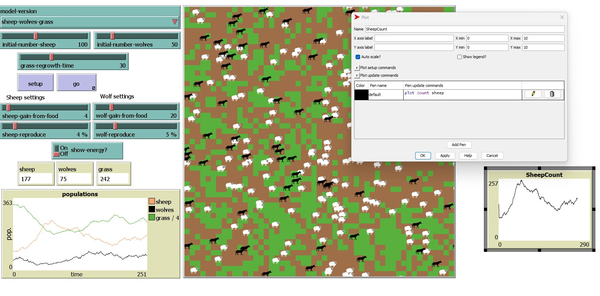
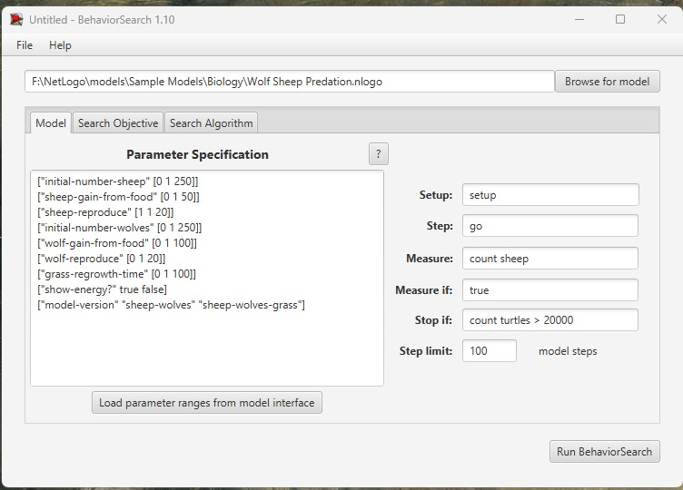
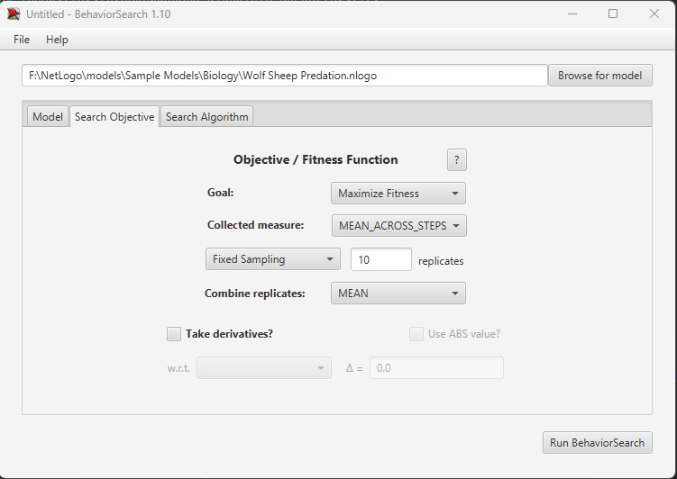
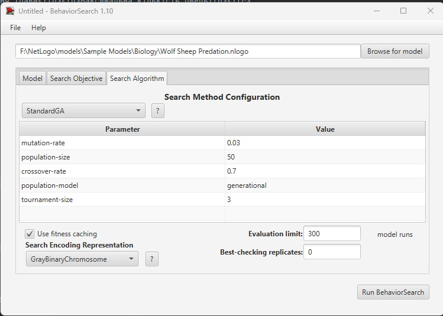
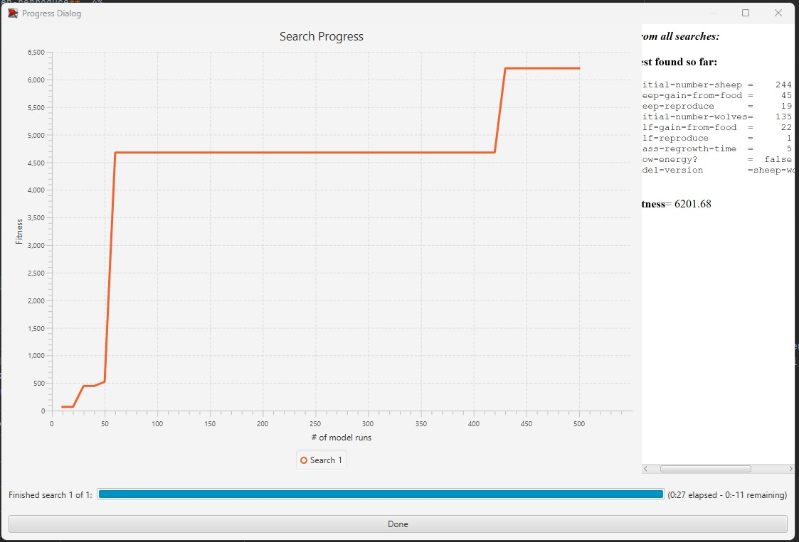
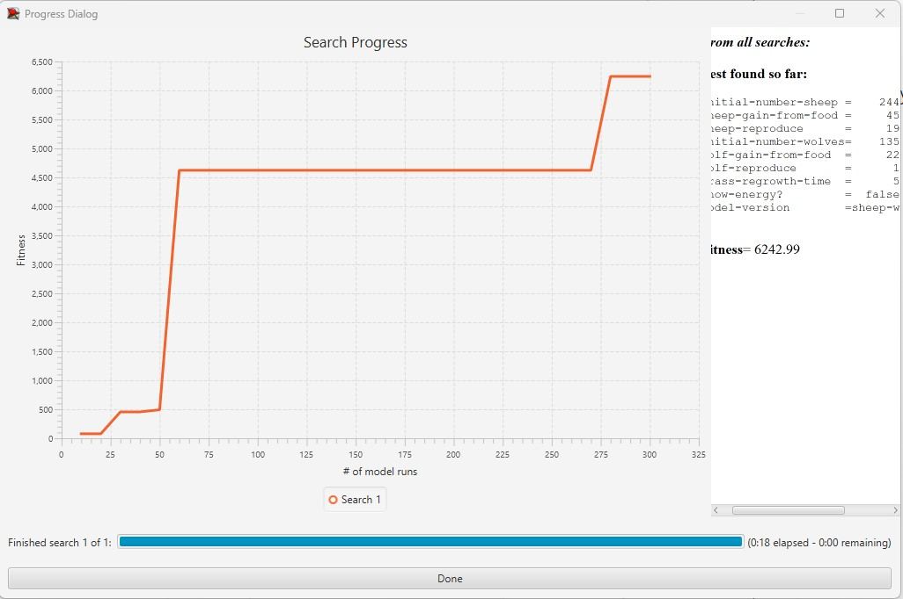

## Комп'ютерні системи імітаційного моделювання
## СПм-22-3, **Дюльгер Владислав Дмитрович**
### Лабораторна робота №**3**. Використання засобів обчислювального интелекту для оптимізації імітаційних моделей

 

### Варіант 7, модель у середовищі NetLogo:
[Wolf Sheep Predation](https://www.netlogoweb.org/launch#http://www.netlogoweb.org/assets/modelslib/Sample%20Models/Biology/Wolf%20Sheep%20Predation.nlogo)

 

#### Вербальний опис моделі:
Базова версія моделі [Wolf Sheep Predation](https://www.netlogoweb.org/launch#http://www.netlogoweb.org/assets/modelslib/Sample%20Models/Biology/Wolf%20Sheep%20Predation.nlogo).Ця модель досліджує стабільність екосистем хижак-жертва. Вовки та вівці випадково блукають по ландшафту, при цьому вовки шукають вівцей для полювання. Кожен крок вимагає від вовків енергії, і вони повинні поїдати вівців для поповнення своєї енергії - коли їм закінчується енергія, вони помирають. Щоб забезпечити продовження популяції, у кожного вовка або вівці є фіксована ймовірність розмноження на кожному кроці часу.

#### Керуючі параметри:
- **model-version**. Визначає моделюємо ми овець, вовків і траву, чи просто овець і вовків.
- **initial-number-sheep**. Визначає початкову кількість вівцей у моделі.
- **initial-number-wolves**. Визначає початкову кількість вовків у моделі.
- **grass-regrowth-time**. Скільки часу потрібно, щоб трава відростала після того, як її з’їли (Зверніть увагу, що це не використовується у версії моделі вівці-вовки)
- **sheep-gain-from-food**. кількість енергії, яку вівці отримують за кожну з’їдену травинку.
- **wolf-gain-from-food**. Кількість енергії, яку отримують вовки за кожну з’їдену вівцю.
- **sheep-reproduce**. Визначає ймовірність, з якою вівці розмножуються під час кожного кроку симуляції.
- **wolf-reproduce**. Визначає ймовірність, з якою вовки розмножуються під час кожного кроку симуляції.
- **show-energy**. Визначає показувати чи ні енергію кожної тварини числом.

### Показники роботи системи:
- Кількість вівець.
- Кількість вовків.
- Кількість трави.

 

### Налаштування середовища BehaviorSearch:

**Обрана модель**:
<pre>
NetLogo\models\Sample Models\Biology\Wolf Sheep Predation.nlogo
</pre>
**Параметри моделі** (вкладка Model):  
*Параметри та їх модливі діапазони були **автоматично** вилучені середовищем BehaviorSearch із вибраної імітаційної моделі, для цього є кнопка «Завантажити діапазони параметрів із інтерфейсу моделі»*:
<pre>
["initial-number-sheep" [0 1 250]]
["sheep-gain-from-food" [0 1 50]]
["sheep-reproduce" [1 1 20]]
["initial-number-wolves" [0 1 250]]
["wolf-gain-from-food" [0 1 100]]
["wolf-reproduce" [0 1 20]]
["grass-regrowth-time" [0 1 100]]
["show-energy?" true false]
["model-version" "sheep-wolves" "sheep-wolves-grass"]
</pre>
Використовувана **міра**:  
Для фітнес-функції було обрано **значення кількості вівець**, вираз для її розрахунку взято з налаштувань графіка аналізованої імітаційної моделі в середовищі NetLogo  
  
та вказано у параметрі "**Measure**":
<pre>
count sheep
</pre>

Загальний вигляд вкладки налаштувань параметрів моделі:  

**Налаштування цільової функції** (вкладка Search Objective):  
Метою підбору параметрів імітаційної моделі, є **максимізація** значення кількості вівець на полі – це вказано через параметр "**Goal**" зі значенням **Maximize Fitness**. Тобто необхідно визначити такі параметри налаштувань моделі, у яких виживає максимальні кількість вівець.
Загальний вигляд вкладки налаштувань цільової функції:  

**Налаштування алгоритму пошуку** (вкладка Search Algorithm):  
Загальний вид вкладки налаштувань алгоритму пошуку:  

 

### Результати використання BehaviorSearch:
Результат пошуку параметрів імітаційної моделі, використовуючи **генетичний алгоритм**:  

Результат пошуку параметрів імітаційної моделі, використовуючи **випадковий пошук**:  

 

### **Відповіді**
1. Оптимізаційні моделі використовуються для пошуку оптимальних рішень в умовах обмежень. Це може бути застосовано до широкого спектру задач, включаючи проекти, виробництво, економіку, аналіз даних тощо.
2. Середовище BehaviorSearch в NetLogo включає етапи налаштування параметрів моделі, визначення цільових метрик, вибір алгоритму пошуку та виконання експериментів для оцінки впливу параметрів на цільові метрики.
3. Цільова функція або функція пристосованості визначає, наскільки добре відповідає поточний варіант рішення поставленому завданню. В оптимізаційних задачах мета полягає в максимізації або мінімізації цієї функції.
4. Простір пошуку визначає множину можливих комбінацій значень параметрів, яку можна досліджувати при пошуку оптимального рішення в оптимізаційній задачі.
5. У середовищі BehaviorSearch можна використовувати різні алгоритми пошуку, такі як випадковий пошук, генетичні алгоритми, методи оптимізації типу "гілки та межі" (Branch and Bound), тощо.
6. Метод випадкового пошуку використовує випадковим чином згенеровані точки у просторі пошуку для оцінки цільової функції.
7. Середнє арифметичне обчислюється як сума всіх значень поділена на кількість значень, тоді як медіана - це значення, що розташоване посередині впорядкованого набору даних.
8. Критерії зупинки включають у себе задану кількість ітерацій, досягнення певного значення цільової функції, чи зміна значення функції пристосованості менше заданого порогу.
9. Етапи генетичного алгоритму включають ініціалізацію популяції, оцінку пристосованості, вибір батьків, застосування генетичних операторів (кросовер та мутація), створення нової популяції та повторення цих етапів.
10. Генетичні оператори включають кросовер (схрещування) та мутацію.
11. Кросовер (схрещування) включає обмін частинами генетичної інформації між двома батьками для створення потомства. Одні з найпоширеніших методів вибору особин для кросовера - це випадковий вибір пари батьків з популяції.
12. Оператор мутації застосовується для випадкового змінення значень генів у варіантах рішень, щоб зберегти різноманітність у популяції і уникнути преждевременної збіжності.
13. Способи кодування можуть включати бінарний код, змінній код, або будь-який інший метод представлення генотипу варіанта рішення.
14. Недоліки включають зазвичай високі обчислювальні витрати та можливість застрягання в локальних мінімумах. Переваги включають здатність роботи з великими просторами пошуку та здатність робити глобальний пошук.
15. Алгоритм імітації відпалу моделює процеси, які відбуваються при замерзанні речовини. Він використовує пониження температури для зменшення ймовірності прийняття гірших рішень, що дозволяє алгоритму "вибиратися" з локальних мінімумів.
16. Метод сходженням до вершини є методом оптимізації, який спочатку обирає початкову точку, а потім рухається в напрямку найшвидшого зростання градієнту цільової функції, змінюючи параметри таким чином, щоб максимізувати функцію пристосованості.
